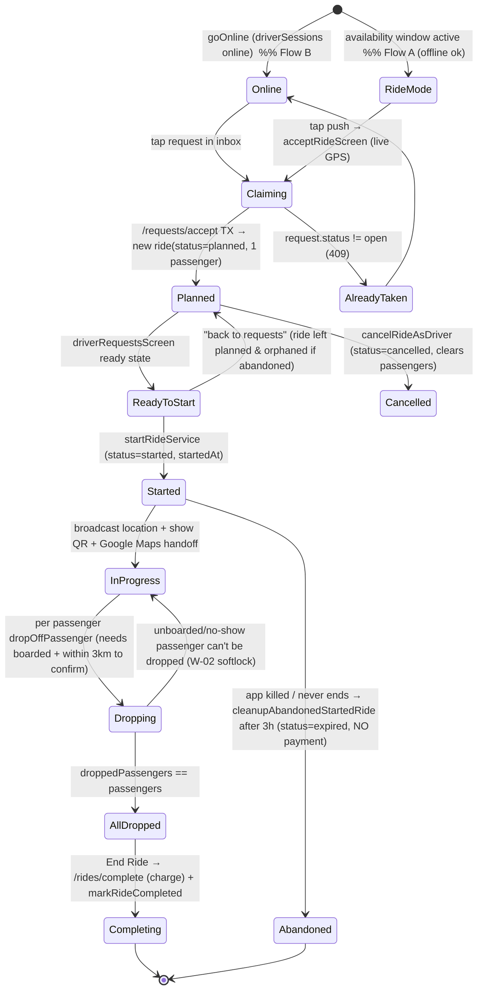

# UniLift — Ride Lifecycle Audit & Process Map

**Scope:** Complete driver + passenger ride lifecycle in the `unilift` Expo/React Native app and its Firebase Cloud Functions backend (`functions/index.js`), Firestore security rules (`firestore.rules`), and Stripe integration.
**Method:** Read-only trace of actual code. Every claim cites a file + function. No application code was modified.
**Sibling repo (`unilift-rides`):** Verified — it is the **marketing website + founder admin metrics dashboard + Hype-events management** (`src/lib/adminMetrics.ts`, `src/lib/eventsRepo.ts`, `src/pages/*`). It contains **no ride, matching, request, or dispatch logic**. `eventsRepo.ts` has zero ride/match/request references. All ride logic lives in `unilift`.

---

## Executive Summary

- **There is effectively ONE working end-to-end ride flow, not several.** The passenger posts an on-demand `rideRequest` from the home map; a driver claims it via the atomic `/requests/accept` Cloud Function, which mints a **fresh single-passenger ride**. Everything else the code contains — passenger "request to join" an existing ride, "enroll in a future ride," driver "create a planned ride," and the sophisticated closest-point-on-polyline **detour matcher** — is **orphaned dead code with no caller in `app/`**.
- **~5 real entry points** exist (passenger on-demand request; driver live inbox; driver Ride-Mode push; passenger match-push; re-entry via home poll / active-ride banner). Boarding adds a QR sub-flow. See Phase 2.
- **Biggest risks (detail in Phase 5):**
  1. **Passenger can rewrite their own `passengerPickups` via client Firestore rules** → server bills distance from pickup→dest → **passenger sets pickup = destination and pays the $1 minimum** (financial exploit, W-01).
  2. **A no-show / never-boards passenger soft-locks the whole ride** — the driver can only "End Ride" once *all* passengers are dropped, and can't drop an unboarded passenger, with no cancel button in the in-progress panel (W-02).
  3. **`boardedPassengers` is written by a full-array read-modify-write PATCH from the passenger client** → concurrent boards clobber each other, and a passenger can self-board without scanning (W-03).
  4. **No timeouts anywhere**: `rideRequest` stays `open` forever, a `planned` ride the driver never starts leaves the passenger waiting forever, and `paymentStatus:"processing"` can wedge permanently (W-06/W-07/W-08).
  5. **Payments are largely non-functional in production**: monthly billing is commented out, driver payout is a stub (no Stripe Connect transfer), and the client `/rides/complete` call is best-effort/swallowed (W-11..W-14).
- **Top 3 fixes:** (P0) Move **status, boarding, pickups/dropoffs, and completion to server-authoritative Cloud Functions with Firestore transactions**, and tighten `firestore.rules` so clients can't write those fields. (P0) Add **expiry/timeout jobs** for `rideRequests`, `planned` rides, and stuck `processing`. (P1) Implement **real Stripe charge + Connect payout** with idempotent webhooks and a reconciliation sweep.

> **Verification note:** No test runner is configured (`CLAUDE.md`), so these findings are from static tracing. Items marked *inferred* could not be executed.

---

## Phase 1 — Inventory

### Working (live) ride-flow files

| File | Layer | Responsibility in the ride flow |
|---|---|---|
| `app/(tabs)/index.tsx` | UI (passenger + role toggle) | Home map. Passenger: `createRideRequest` + `dispatchRideRequest` → `findingDriverScreen`. Driver: → `driveOnlineScreen`. Background `syncRides` poll re-pushes passengers into started rides. Lazy expiry cleanup. |
| `app/driveOnlineScreen.tsx` | UI (driver) | "Go online" form (destination, seats, match radius) → `goOnline()` → `driverRequestsScreen`. |
| `app/driverModeScreen.tsx` | UI (driver) | Ride-Mode recurring availability windows (`driverAvailability`/`driverDays`) — Flow A config. |
| `app/driverRequestsScreen.tsx` | UI (driver) | Live inbox: `onSnapshot` open `rideRequests`, client detour filter (`detourFor`), `acceptRideRequest`, "ready to start", `startRideService` → `riderScreen`. Also the landing screen after a push-accept. |
| `app/acceptRideScreen.tsx` | UI (driver) | Push-notification accept sheet. Captures live GPS as fallback origin, `acceptRideRequest` → `driverRequestsScreen` ready state. |
| `app/findingDriverScreen.tsx` | UI (passenger) | Radar waiting screen. `onSnapshot` the `rideRequest`; on `matched` → `rideScreen`; on `cancelled/expired` → back. |
| `app/riderScreen.tsx` | UI (driver, live) | Driver live ride: join-request accept/reject (dead inputs, see W-19), start, QR generation, live location broadcast, per-passenger dropoff, end-ride → payment + completion. |
| `app/rideScreen.tsx` | UI (passenger, live) | Passenger live ride: adaptive poll of ride doc; pending→accepted→started→boarded→completed; QR scan to board; mandatory rating. |
| `services/rideRequestService.ts` | Service (REST) | `createRideRequest`, `fetchRideRequestById`, `fetchOpenRideRequests`, `fetchMyRideRequests`, `cancelRideRequest`. |
| `services/driverSessionService.ts` | Service (REST + API) | `goOnline`/`goOffline`, `updateDriverSessionLocation`, `acceptRideRequest` (→ `/requests/accept`), `dispatchRideRequest`, `fetchAvailableDriverCount`, `countOnlineDrivers`. |
| `services/rideServices.ts` | Service (REST) | Live pieces: `fetchRides`, `fetchRideById`, `startRideService`, `updateDriverLocation`, `markPassengerDropped`, `markRideCompleted`, `submitRating`, `updateRatings`, `updateXP`, `cancelJoinRequest`, `cancelRideAsDriver`, `cleanupExpiredRide`, `cleanupAbandonedStartedRide`. |
| `services/paymentService.ts` | Service (REST + API) | `generateQrToken`, `validateAndBoardPassenger` (boarding), `processRidePayments` (→ `/rides/complete`). |
| `functions/index.js` | Cloud Functions (Express `api`) | `/requests/accept` (atomic claim), `/requests/dispatch`, `/drivers/available`, `/rides/complete` (payment), `/rides/can-join`, `/wallet/*`, `/billing/*`, `/notifications/send`, `/account/delete`, `/social/*`, `/events/interest`; callable `getAdminMetrics`. |
| `firestore.rules` | Security rules | Field-level authZ for `users`, `rides`, `rideRequests`, `driverSessions`, `events`, `transactions`. |
| `hooks/use-push-notifications.ts` | Client routing | Routes `passenger_request` → `acceptRideScreen`; `driver_accepted` → `rideScreen`. |
| `hooks/use-driver-session.ts` | State | Loads/refreshes the driver's `driverSessions/{uid}`; `isOnline`. |
| `hooks/use-adaptive-polling.ts` | State | Backoff poller used by `rideScreen`. |
| `context/ActiveRideContext.tsx` | State | Persists the active ride so app-kill / Google-Maps hand-off can resume. |
| `components/QrCodeDisplay.tsx` / `QrScanner.tsx` | UI | Boarding QR render / scan. |
| `components/mapview.tsx` | UI | `RideMapView`, `DriverRideMapView`, `UserRideMapView`. |
| `components/ratings.tsx` | UI | Post-ride rating screen. |
| `components/profile/planned-rides-list.tsx` | UI (driver) | Driver's own `planned` rides in profile → "Manage" (`riderScreen`) / "Cancel" (`cancelRideAsDriver`). |
| `components/profile/passenger-rides-list.tsx` | UI (passenger) | Passenger's ride history. |
| `hooks/use-profile-rides.ts` | State | `cancelRide` (wired); `startRide` (**dead**, `onRideStarted` is a no-op). |
| `constants/pricing.ts` / `functions` mirror | Domain | Fare math (25¢/km passenger, 20¢/km driver, $1 floor). |
| `constants/cancellation.ts` | Domain | Fees — **all set to 0** — + grace window. |
| `utils/ride-lifecycle.ts` | Domain | `isRideLive/Scheduled/Expired/Joinable` (3 h live window). |

### Orphaned / dead / vestigial ride code (defined, **no caller in `app/`**)

| File / symbol | Was for | Evidence |
|---|---|---|
| `services/rideServices.ts` → `createRide` | Driver creating a *planned* ride | No caller; `app/createRideScreen.tsx`, `components/create-ride.tsx`, `components/ridecard.tsx` are **deleted** (git status). |
| `services/rideServices.ts` → `requestToJoinRide`, `acceptRide`, `enrollInFutureRide`, `quitRide` | Passenger joining/enrolling/quitting an existing ride | Grep: only definitions, no call sites. |
| `services/rideServices.ts` → `respondToJoinRequest` | Driver approving join requests | Called by `riderScreen` accept/reject buttons — but **nothing creates `joinRequests` anymore** (W-19), so those buttons never render. |
| `utils/matching/matchRide.ts` (`findMatchesForPassenger`), `utils/matching/geometry.ts` (`computeDetour`, `projectOntoPolyline`, `closestPointOnSegment`), `hooks/use-ride-recommendations.ts` (`useDetourRecommendations`, `recommendRides`) | The "direction-aware detour: bbox pre-filter + closest-point projection + Haversine" matcher described in the brief | `useDetourRecommendations`/`findMatchesForPassenger` have **no caller in `app/`**. The live flows use different, simpler matchers (see Phase 4). |
| `services/rideServices.ts` → `updateDriverLocation` writes `driverLocation` | Passenger live-tracking the driver | Written by driver, but `rideScreen` hard-codes `driverLocation={undefined}` — **never displayed** (W-16). |

> **Note on the brief's "bounding-box pre-filter":** No bounding-box pre-filter exists in any live path. `findMatchesForPassenger` iterates every ride with no bbox (and is orphaned anyway). The live matchers are O(n) scans (Phase 4, W-21).

---

## Phase 2 — Entry Points

Because ride creation is centralized in `/requests/accept`, **a ride is *always* born the same way: a driver claims a passenger `rideRequest`.** The variety is in how each side *reaches* that moment.

### EP-1 — Passenger on-demand request (primary)
- **Initiator / trigger:** Passenger taps a place/suggestion on the home map (`role === "passenger"`) → `RequestLiftSheet` → "Demander un lift" (`app/(tabs)/index.tsx:handleChoosePassengerWith`).
- **Preconditions:** `ensurePaymentMethodOrAlert` (a saved Stripe PM); GPS origin available.
- **Writes/calls:** `createRideRequest` → **`rideRequests/{id}`** `{passengerId, origin(GeoPoint), destination, destinationCoords, seatsRequested:1, status:"open", date: now}` → `dispatchRideRequest(id)` (`POST /requests/dispatch`).
- **Counterpart sees:** Eligible drivers get an Expo push (`passenger_request`). Passenger lands on `findingDriverScreen` listening to the request doc.

### EP-2 — Driver live inbox (Flow B / "Live Drive")
- **Initiator / trigger:** Driver toggles "Drive" on home → `driveOnlineScreen` → `goOnline()` writes **`driverSessions/{uid}`** `{origin(live GPS), destination, seatsAvailable, maxDetourKm, destinationRadiusKm, status:"online", routePolyline, baseRouteKm}` → `driverRequestsScreen`.
- **What they see:** `onSnapshot` of all `status=="open"` `rideRequests`, filtered client-side by `detourFor(session, r) ≤ maxDetourKm` and `seatsRequested ≤ seatsAvailable`, sorted by detour.
- **Action:** `acceptRideRequest(id)` → `/requests/accept`.

### EP-3 — Driver Ride-Mode push (Flow A, may be offline)
- **Initiator / trigger:** Driver configured recurring availability windows in `driverModeScreen` (`driverAvailability` + derived `driverDays`). When a passenger dispatch fires and the current time is inside a window whose destination is within radius of the passenger's dropoff, the backend pushes them (`/requests/dispatch` Phase 1b) — **no live GPS required**.
- **Action:** Push tap → `acceptRideScreen` → captures live GPS as the fallback driver origin → `acceptRideRequest(id, {origin, destination, destinationCoords, seats})`. The server uses these because there is no online session.

### EP-4 — Passenger match notification
- **Trigger:** `/requests/accept` pushes the passenger `driver_accepted {rideId}`.
- **Action:** Tap → `use-push-notifications` routes to `rideScreen?rideId=…&pending=false` — **without origin/destination coords** (W-17: map renders 0,0).

### EP-5 — Re-entry / resume
- **Passenger:** `app/(tabs)/index.tsx:syncRides` polls `fetchRides` every 15 s; if the user is a passenger in a `started` ride not yet dropped, it `router.push`es `rideScreen` (carries coords).
- **Driver:** `ActiveRideContext` + a floating availability banner (`app/_layout.tsx`) restore `riderScreen`; profile `PlannedRidesList` → "Manage" also opens `riderScreen` for an owned `planned` ride.

### EP-6 — Boarding sub-flow
- Driver shows a QR (`generateQrToken` writes `qrToken`/`qrTokenExpiresAt`, 10 min). Passenger `rideScreen` → `QrScanner` → `validateAndBoardPassenger` appends to `boardedPassengers`.

### Vestigial entry points (present in code, unreachable)
- Passenger "request to join" a specific existing ride (`requestToJoinRide`) — no UI.
- Passenger "enroll in a future/scheduled ride" (`enrollInFutureRide`) — no UI; scheduled rides (`departureAt`) unused in live flow (`createRideRequest` always sets `date: now`, `seatsRequested:1`).
- Driver "create a planned ride" (`createRide`) — screen deleted.

> **Instant vs scheduled:** Only **instant** exists in practice. The data model + orphaned services support scheduling, but no live path emits a future `departureAt`.

---

## Phase 3 — Full Lifecycle State Machine

### 3.1 Passenger state diagram

```mermaid
stateDiagram-v2
    [*] --> Requesting: create rideRequest (status=open) + dispatch
    Requesting --> Waiting: findingDriverScreen (listen rideRequest)
    Waiting --> Accepted: rideRequest.status=matched (driver claimed) → rideScreen(pending=false)
    Waiting --> Cancelled: passenger cancels (deletes request)
    Waiting --> Waiting: no driver responds (NO TIMEOUT — indefinite) 

    Accepted --> Started: ride.status=started (driver started)
    Accepted --> RideCancelled: ride.status=cancelled (driver cancelled)
    Accepted --> Accepted: driver never starts (NO TIMEOUT — indefinite)

    Started --> Boarded: scan driver QR → boardedPassengers += uid
    Started --> Started: never scans (stuck; blocks driver — W-02)

    Boarded --> DroppedConfirmed: uid in confirmedDropoffPassengers → completed
    Boarded --> DroppedUnconfirmed: uid in droppedPassengers only → home (NOT charged, NOT rated)

    DroppedConfirmed --> Rating: mandatory RatingScreen
    Rating --> [*]: updateRatings + updateXP + submitRating
    DroppedUnconfirmed --> [*]
    Cancelled --> [*]
    RideCancelled --> [*]

    note right of Accepted
      Once accepted there is NO passenger
      cancel path (quit button only shows
      while pending). quitRide() orphaned. (W-04)
    end note
```

### 3.2 Driver state diagram



### 3.3 Canonical happy-path sequence

```mermaid
sequenceDiagram
    participant P as Passenger app
    participant D as Driver app
    participant FS as Firestore (rules-gated REST/SDK)
    participant CF as Cloud Functions (api)
    participant S as Stripe

    P->>FS: createRideRequest (rideRequests/{id} status=open)
    P->>CF: POST /requests/dispatch {requestId}
    CF->>FS: query online driverSessions + Ride-Mode users
    CF-->>D: Expo push "passenger_request"
    D->>CF: POST /requests/accept {requestId, [gps fallback]}
    CF->>FS: TX: request.status=matched, create rides/{rideId} (planned, 1 passenger)
    CF-->>P: Expo push "driver_accepted" {rideId}
    P->>FS: listen rideRequest → matched → open rideScreen
    D->>FS: startRideService (rides.status=started)
    D->>FS: generateQrToken (qrToken/expiresAt)
    P->>FS: validateAndBoardPassenger (boardedPassengers += uid)
    D->>FS: updateDriverLocation (throttled 5s) [not shown to P]
    D->>FS: markPassengerDropped (confirmed if <3km) → confirmedDropoffPassengers, pendingRatings
    D->>CF: POST /rides/complete {rideId, confirmedPassengerIds}
    CF->>FS: TX/batch: passenger.pendingChargeCents += fare; driver.pendingEarningsCents += ; ride.paymentStatus=completed
    D->>FS: markRideCompleted (status=completed, preserve pendingRatings)
    P->>FS: updateRatings + updateXP + submitRating
    Note over S: Real card charge only at month-end via /billing/charge-monthly (currently NOT scheduled)
```

### 3.4 Transition table

| State | Trigger in | Who can act | Valid transitions out | Firestore field(s) | Function(s) |
|---|---|---|---|---|---|
| request `open` | passenger creates | passenger | `matched` / `cancelled` / (no `expired` producer) | `rideRequests.status`, `matchedRideId`, `matchedDriverId` | `createRideRequest`, `/requests/accept`, `cancelRideRequest` |
| ride `planned` | `/requests/accept` TX | driver (owner) | `started` / `cancelled` / `expired` | `rides.status`, `passengers`, `passengerPickups/Dropoffs`, `seatsAvailable` | `/requests/accept`, `startRideService`, `cancelRideAsDriver`, `cleanupExpiredRide` |
| ride `started` | `startRideService` | driver | `completed` / `expired`(abandon) | `status`, `started`, `startedAt`, `driverLocation`, `boardedPassengers` | `startRideService`, `updateDriverLocation`, `validateAndBoardPassenger` |
| in-progress dropoff | `markPassengerDropped` | driver | all-dropped → complete | `droppedPassengers`, `confirmedDropoffPassengers`, `pendingRatings` | `markPassengerDropped` |
| payment | End Ride | driver → CF | `paymentStatus: pending→processing→completed` | `rides.paymentStatus`, `users.pendingChargeCents/pendingEarningsCents`, `transactions/*` | `/rides/complete` |
| ride `completed` | `markRideCompleted` | driver (client-set) | rating | `status`, `pendingRatings`, `ratingsSubmitted` | `markRideCompleted`, `submitRating`, `updateRatings`, `updateXP` |
| boarding | QR scan | passenger | `boarded` | `boardedPassengers`, `qrToken`, `qrTokenExpiresAt` | `generateQrToken`, `validateAndBoardPassenger` |

---

## Phase 4 — Backend & Data

### Firestore data model

**`rideRequests/{id}`** — passenger's open request. `passengerId, passengerName/Avatar, origin (GeoPoint), originLabel, destination, destinationCoords (GeoPoint), date, seatsRequested, status ∈ {open, matched, cancelled, expired}, createdAt, matchedRideId, matchedDriverId`. **Status field = `status`.**

**`rides/{id}`** — created only by `/requests/accept`. `driverId, driverName/Avatar, localisation (driver origin GeoPoint), destination, destinationCoords, date, seatsAvailable, passengers[], passengerSeats{}, passengerPickups{}, passengerDropoffs{}, joinRequests{}, status ∈ {planned, started, completed, expired, cancelled}, started, startedAt, boardedPassengers[], droppedPassengers[], confirmedDropoffPassengers[], pendingRatings[], ratingsSubmitted[], driverLocation, qrToken, qrTokenExpiresAt, paymentStatus ∈ {pending, processing, completed, failed}, maxDetourKm, baseRouteKm, routePolyline`. **Status field = `status`; payment separately = `paymentStatus`.** (Type `RideStatus` in `types/models.ts` omits `cancelled` — a latent mismatch.)

**`driverSessions/{uid}`** — live "online" state (doc id = driver uid). `driverId, origin, destination, destinationCoords, seatsAvailable, maxDetourKm, destinationRadiusKm, status ∈ {online, offline}, routePolyline, baseRouteKm, updatedAt`.

**`users/{uid}`** — profile + financials (`pendingChargeCents`, `pendingEarningsCents`, `stripeCustomerId`, `stripePaymentMethodId`, ratings/xp), Ride-Mode config (`driverAvailability`, `driverDays`, `driverDestinationRadiusKm`), `expoPushToken`, `language`. Subcollection `transactions/*` (function-write only).

**`events/{id}`** — Hype map (read all; write admin claim only).

### Cloud Functions (trigger → writes)

| Function | Trigger | Writes / effect |
|---|---|---|
| `POST /requests/dispatch` | client after creating request | Reads (no write to rides). Fans out Expo pushes: Phase 1a online sessions within 15 km & dest-radius; Phase 1b active Ride-Mode users within dest-radius; Phase 2 fallback = **every** online driver in range + **every** Ride-Mode driver ignoring window/location if `<3` direction matches. |
| `POST /drivers/available` | lift sheet poll | Read-only mirror of dispatch → `count`. |
| `POST /requests/accept` | driver claim | **`runTransaction`**: guard `request.status==open` (first-wins), create `rides/{id}` (planned, 1 passenger), set request `matched`, decrement session seats (auto-offline at 0). Pushes passenger. **Only ride-creation path.** |
| `POST /rides/complete` | driver End Ride | Guard driver == caller; idempotency via `paymentStatus`; set `processing`; batch: passenger `pendingChargeCents += calculatePassengerChargeCents(pickup→dest haversine)`, driver `pendingEarningsCents +=`, write `transactions`, set `paymentStatus=completed`. On error → revert to `pending`. |
| `POST /rides/can-join` | (defined) | Checks caller has a PM. |
| `POST /wallet/*` | client | Stripe customer/ephemeral key/SetupIntent/PM save/remove/transactions. |
| `POST /billing/charge-monthly` | manual/`x-billing-secret` | Off-session `PaymentIntent` per user with `pendingChargeCents>0`, idempotency `monthly-charge-{uid}-{month}`, zero balance on success. **The only real card charge. Scheduler is commented out.** |
| `POST /billing/payout-drivers` | manual | **Stub** — writes `monthly_payout` (status pending), zeroes `pendingEarningsCents`. **No Stripe Connect transfer.** |
| `POST /notifications/send`, `/social/*`, `/account/delete`, `/events/interest`, callable `getAdminMetrics` | client / admin | Non-ride or peripheral. |

### Custom claims, listeners, Stripe timing
- **Custom claims:** only `admin` (for `getAdminMetrics` + `events` writes). **There is no driver/passenger custom-claim gating** despite the brief — role is purely a client UI toggle; the payment-method check (`/rides/can-join`, `assertCurrentUserHasPaymentMethod`) is the only join gate.
- **Real-time listeners:** `onSnapshot` drives `findingDriverScreen` (request), `driverRequestsScreen` (open requests + ready ride), `riderScreen` (ride doc). `rideScreen` uses **polling** (`use-adaptive-polling`), not a listener.
- **Stripe Connect:** **not implemented.** Charging is **deferred accrual** (`pendingChargeCents`) settled monthly off-session; there is no auth/capture at ride time and no payout rail. Driver is "paid" only as a pending ledger row.
- **Two databases:** `uniliftdefault` (prod) vs `uniliftdev`, chosen by the client-supplied `X-App-Env` header (also selects live vs test Stripe).

---

## Phase 5 — Weakness Register

Severity: **P0** critical (money/lock/security) · **P1** major · **P2** minor.

| ID | Sev | Location | Description | Trigger scenario | Impact |
|---|---|---|---|---|---|
| **W-01** | P0 | `firestore.rules` rides passenger clause (`hasOnly([...'passengerPickups','passengerDropoffs'...])`) + `functions/index.js` `/rides/complete` charge from `passengerPickups[pid]` | Passenger may PATCH their own `passengerPickups`; server bills `haversine(pickup→dest)`. | Malicious passenger sets `passengerPickups[me] = destinationCoords` before End Ride. | Fare collapses to $1 floor; **revenue loss / billing integrity broken**. |
| **W-02** | P0 | `app/riderScreen.tsx` `dropOffPassenger` (requires `boardedPassengers.includes`), `allPassengersDropped` gate; no in-progress cancel | Driver can only End Ride when **all** passengers dropped, can't drop an unboarded one, and has no cancel while started. | A passenger never scans the QR (no-show, dead phone, declines). | **Ride soft-locks**: driver can't complete or cancel; ride wedges `started` until 3 h abandon-expiry; no one charged/paid. |
| **W-03** | P0 | `services/paymentService.ts` `validateAndBoardPassenger` (REST GET `boardedPassengers` → PATCH whole array); rules allow passenger to write it | Full-array read-modify-write, no transaction; also no server check that the ride is `started`. | Two passengers scan near-simultaneously → last write wins, one board lost. Or passenger PATCHes `boardedPassengers += self` **without scanning**. | Lost boarding (blocks W-02 dropoff) **and** QR boarding is bypassable → free rides. |
| **W-04** | P0 | `app/rideScreen.tsx` (quit only in `pending`); `quitRide()` orphaned; rules forbid passenger editing `passengers[]` | An **accepted** passenger has no cancel path. | Passenger's plans change after acceptance. | Passenger locked into ride; if they cancel via `cancelJoinRequest` it flips their `joinRequest` to rejected but leaves them in `passengers[]` → inconsistent state. |
| **W-05** | P0 | `firestore.rules` `users` cross-write clause (`!isOwner && hasOnly(['ratings','ratingWeigth','xp','ridesCompleted'])`) + `updateRatings`/`updateXP` client-side | Any signed-in user can rewrite **any other user's** rating/XP/ridesCompleted, unbounded, without being on a ride. Read-modify-write also races (lost updates). | Attacker scripts PATCHes to inflate own-adjacent accounts or tank a rival's rating. | Rating/XP integrity destroyed; leaderboard/trust meaningless. (TODO in rules acknowledges.) |
| **W-06** | P0 | `rideRequests` — no TTL; `/requests/dispatch` sets nothing to expire; `RideRequestStatus` has `expired` but **no producer** | An `open` request never auto-closes. | Passenger force-quits the app on `findingDriverScreen`. | Request lingers `open`; a driver can accept hours later, minting a ride the passenger doesn't know exists → ghost ride, possible charge. |
| **W-07** | P1 | `app/rideScreen.tsx` accepted state; no planned-ride timeout | Passenger accepted, driver never starts. | Driver claims then abandons before starting. | Passenger sits on "waiting for driver to start" **forever** (poll has no give-up); planned ride only cleaned after 3 h and only if some client loads home. |
| **W-08** | P1 | `functions/index.js` `/rides/complete` sets `paymentStatus:"processing"` then batch | If the instance dies **after** `processing` set but **before** batch commit, the `catch` never runs. | Cold-start timeout / crash mid-complete. | Ride wedged `processing`; all future completes short-circuit as `{skipped:true}` → **passengers never charged, driver never paid**, no recovery. |
| **W-09** | P1 | `services/rideServices.ts` `respondToJoinRequest`, `enrollInFutureRide`, `acceptRide` (REST GET→PATCH, no TX) | Seat decrement is read-modify-write with no optimistic lock. | (Mostly orphaned today) two concurrent joins each read `seatsAvailable=1`. | Oversell / `passengers.length > seats`. Live risk low only because these paths are dead; will resurface if re-enabled. |
| **W-10** | P1 | `firestore.rules` rides join-request clause (`hasOnly(['joinRequests'])`, no uid restriction) | **Any** signed-in user can overwrite the entire `joinRequests` map on **any** ride. | Griefer clears/forges join requests on strangers' rides. | Data tampering; if the join flow were live, fake "accepted" entries. |
| **W-11** | P1 | `functions/index.js` `monthlyBilling` scheduled function is **commented out**; `/billing/charge-monthly` manual-only | No automated charge job deployed. | Normal operation. | **No passenger is ever actually charged**; `pendingChargeCents` accrues indefinitely. |
| **W-12** | P1 | `functions/index.js` `payoutAllDrivers` | Payout is a ledger stub; no Stripe Connect transfer/account. | Driver "earns." | **Drivers are never actually paid.** Core value prop unmet. |
| **W-13** | P1 | `app/riderScreen.tsx` `finalizeRide` wraps `processRidePayments` in `try/catch` "non-fatal", then `markRideCompleted` regardless | Charge failure is swallowed; ride still completes. | `/rides/complete` 500 / network blip at End Ride. | Ride marked `completed`, `paymentStatus` left `pending`, **charge lost**, no retry/reconciliation. |
| **W-14** | P1 | `/rides/complete` charge distance = `haversine(pickup→dest)`; unconfirmed dropoffs excluded from `confirmedPassengerIds` | Straight-line under-count; a `>3 km` dropoff is never charged/rated. | Detour rides; driver drops passenger far from stated dropoff. | Systematic under-billing; some rides fully free; driver under-credited. |
| **W-15** | P1 | `firestore.rules` rides driver clause allows writing `status` freely; `markRideCompleted`/`startRideService` set status **client-side** | Ride status is **not** server-authoritative (only `paymentStatus` is). | Driver client (or a crafted request) sets `status:"completed"`/`"started"` arbitrarily. | Status spoofing; e.g., mark completed without dropping, skip payment path. |
| **W-16** | P1 | `app/rideScreen.tsx` `driverLocation={undefined}` (hard-coded); `updateDriverLocation` still writes | UI shows a "live tracking" badge but never plots the driver. | Every accepted ride. | Passengers can't see the driver despite the promise; wasted Firestore writes; misleading UX. |
| **W-17** | P2 | `hooks/use-push-notifications.ts` `driver_accepted` → `rideScreen?rideId=…&pending=false` (no coords) | Match-push route omits `Originlat/OriginLng/DestinationLat/DestinationLng`. | Passenger taps the "accepted" push (vs. auto-navigation from `findingDriverScreen`). | `rideScreen` map renders origin/destination at `(0,0)`. |
| **W-18** | P1 | `app/(tabs)/index.tsx` `handleChoosePassengerWith` → `findingDriverScreen`; `dispatch` may notify 0 | If `notified===0` (no tokens / no drivers), nothing else happens. | Passenger requests when no eligible driver online. | Passenger waits indefinitely with no signal / no timeout / no "none found." |
| **W-19** | P2 | `app/riderScreen.tsx` join-request UI depends on `ride.joinRequests`; no live path creates them (`requestToJoinRide` orphaned) | Entire pre-start "accept/reject join requests" section is dead; each ride is single-passenger. | Always. | The advertised multi-passenger carpool (one driver, several riders on route) **isn't achievable** via current UI — each accept mints a separate ride. |
| **W-20** | P2 | `app/riderScreen.tsx` `cancelRide`/end paths push no notification; `cancelRideAsDriver` only flips status | Driver cancellation reaches the passenger only via their in-app poll. | Driver cancels while passenger app is backgrounded/closed. | Passenger uninformed until they reopen; no push. |
| **W-21** | P2 | `functions/index.js` `/requests/dispatch` & `/drivers/available` scan all `driverSessions` online + all `users` with `driverDays array-contains-any [all weekdays]` | O(n) full-collection scans; no geohash index; fallback pushes **every** Ride-Mode driver regardless of location. | Growth; sparse driver pool triggering fallback. | Non-scaling reads; **push spam + location/PII leak** (passenger name + route to far-away drivers). |
| **W-22** | P2 | `firestore.rules` `rideRequests`/`rides` `allow read: if isSignedIn()` | Any signed-in user reads **all** requests/rides incl. precise pickup GeoPoints & home. | Any account. | **Privacy / Loi 25**: mass harvest of users' pickup/home coordinates. |
| **W-23** | P2 | `utils/matching/geometry.ts` `closestPointOnSegment` treats lat/lng as planar (Cartesian degrees) | Longitude degrees aren't isometric with latitude; projection skews (~cos φ ≈ 0.66 at 46°N). | Detour matching near the route edge. | Mis-ranked/omitted matches — but **orphaned**, so no live impact today. |
| **W-24** | P2 | `components/request-lift-sheet.tsx` hardcoded French ("Demander un lift", "conducteurs disponibles"); `use-push-notifications` deep-links bypass `NotificationGateScreen` | i18n not routed through `t()`; English users see French on a core CTA. | English user opens the lift sheet. | French-first is inconsistent — but here it **breaks** English, not French. |
| **W-25** | P2 | Glass live screens `app/rideScreen.tsx` / `riderScreen.tsx` — `C.muted #9ca3af`, `C.dim #4b5563` on translucent scrims; 11 px labels | Low-contrast small text over `BlurView` + `rgba(10,8,18,0.78)` scrim. `#4b5563` on the scrim is **~2.9:1** (fails WCAG AA 4.5:1); `#9ca3af` ~5.4:1 passes normal but several are <14 px. | Live ride screens (the exact glassmorphism surfaces flagged in the prior App Store rejection). | AA contrast failures on `dim`/small muted text → re-rejection risk. Needs a contrast pass. |
| **W-26** | P2 | `app/(tabs)/index.tsx` `syncRides` `router.push('/rideScreen')` on poll | Guarded by `activeRide`, but re-push races can stack instances. | Poll fires as the screen mounts. | Occasional state-reset "flash" (comments acknowledge prior reports). |

---

## Phase 6 — Recommendations

Legend: **[S]** server-side (preferred for authority) · **[C]** client-side.

### P0 — do first (money, locks, security)

1. **W-01/W-03/W-15 — Make ride state server-authoritative.** [S] Introduce Cloud Functions `POST /rides/board`, `/rides/start`, `/rides/dropoff`, and reuse `/rides/complete`, each verifying caller role and mutating status/`boardedPassengers`/`passengerPickups`/`droppedPassengers` inside a `runTransaction`. Then **tighten `firestore.rules`** so passengers can write **nothing** on `rides` except (optionally) their own `ratingsSubmitted`, and never `passengerPickups`/`boardedPassengers`/`status`. Pickups must be copied from the immutable `rideRequest.origin` on the server, never client-supplied at completion.
2. **W-02/W-04 — Unstick the ride.** [S+C] Add `/rides/cancel` (driver, any state) and `/rides/leave` (passenger, pre-board) as transactional endpoints that release seats + notify. In `riderScreen`, allow **End Ride for boarded passengers even if some never boarded** (mark no-shows explicitly, exclude from charge), and always show a driver "Cancel/End" control while `started`.
3. **W-05/W-10/W-22 — Close the rules holes.** [S] Move `updateRatings`/`updateXP` into a Cloud Function that verifies the caller shared the ride (delete the `!isOwner` users-write rule and the unrestricted `joinRequests` rule). Restrict `rides`/`rideRequests` reads to participants (or expose a minimal, PII-free projection for discovery).
4. **W-06/W-07/W-08 — Timeouts & recovery.** [S] Add a scheduled function (Cloud Scheduler / `pubsub.schedule`) that: expires `rideRequests` older than N min still `open`; expires `planned` rides never started within N min (notifying the passenger); and resets `paymentStatus:"processing"` older than a few minutes back to `pending` for retry. Give `findingDriverScreen` a client-side give-up + "no drivers found, retry" (W-18).

### P1 — payments & correctness

5. **W-11/W-12/W-13/W-14 — Real, reconciled money.** [S] Deploy the scheduled `monthlyBilling`; implement **Stripe Connect** express accounts + transfers for `payoutAllDrivers`; make `/rides/complete` the **authoritative, retried** step (queue + idempotency key per ride) rather than a swallowed client call; compute fare from the **actual routed distance** (`routePolyline`/Directions), and decide policy for `>3 km` unconfirmed dropoffs (charge partial vs. free, but make it intentional).
6. **W-09 — Transactional seats.** [S] If/when multi-passenger join is revived, do seat decrements in `runTransaction` (like `/requests/accept` already does) — never REST read-modify-write.
7. **W-16 — Deliver live tracking or remove the claim.** [C] Either plot `ride.driverLocation` (already written) on `UserRideMapView` and keep the broadcast alive via background location, or drop the "live tracking" badge.

### P2 — polish & scale

8. **W-19 — Decide the product truth.** Either wire the join-request multi-passenger flow back in (passenger UI → `requestToJoinRide`, revive `riderScreen` accept/reject) so one ride can carry several riders, **or delete** the orphaned join/detour/scheduled code (`createRide`, `requestToJoinRide`, `enrollInFutureRide`, `quitRide`, `useDetourRecommendations`, `matchRide.ts`, `geometry.ts`) to stop it rotting and misleading. If revived, fix the planar-projection bug (W-23) with proper equirectangular scaling.
9. **W-17/W-20/W-24 — UX correctness.** Carry coords on the `driver_accepted` deep link; push the passenger on driver cancel; route all copy through `t()`.
10. **W-21 — Scale matching.** Add geohash bucketing / a maintained "active drivers" index and cap the fallback fan-out by distance to stop PII leakage and full-scan cost.
11. **W-25 — Contrast pass.** Audit `rideScreen`/`riderScreen` glass surfaces against WCAG AA: raise `#4b5563`/small `#9ca3af` text, or thicken the scrim / enlarge type. This is the exact surface class behind the prior App Store rejection.

---

### Appendix — Confidence & gaps
- **High confidence:** entry points, `/requests/accept` transaction, rules field lists, payment accrual model, orphaned-code set (grep-verified no callers).
- **Inferred (not executed — no test runner):** exact race outcomes (W-03/W-09), the `processing`-wedge (W-08), and contrast ratios (W-25, computed from tokens, not a device render). Recommend confirming W-01/W-03 against a Firestore emulator with the shipped `firestore.rules`.
